**QQ讨论群：237626046**

**技术支持与运维服务：+微信【Cheng-ShaoYong】**

## 一、功能介绍
 <p></p>

## 二、产品截图
#### 1、平台管理端
<div style="text-align: center">
    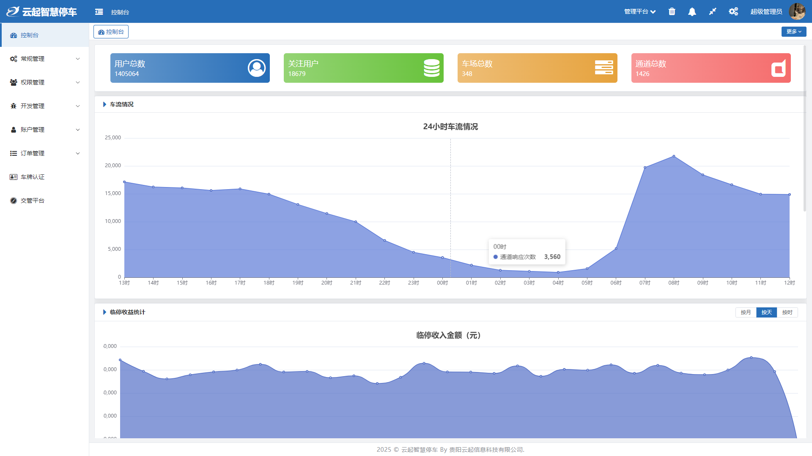
</div>

#### 2、停车场管理端
<div style="text-align: center">
    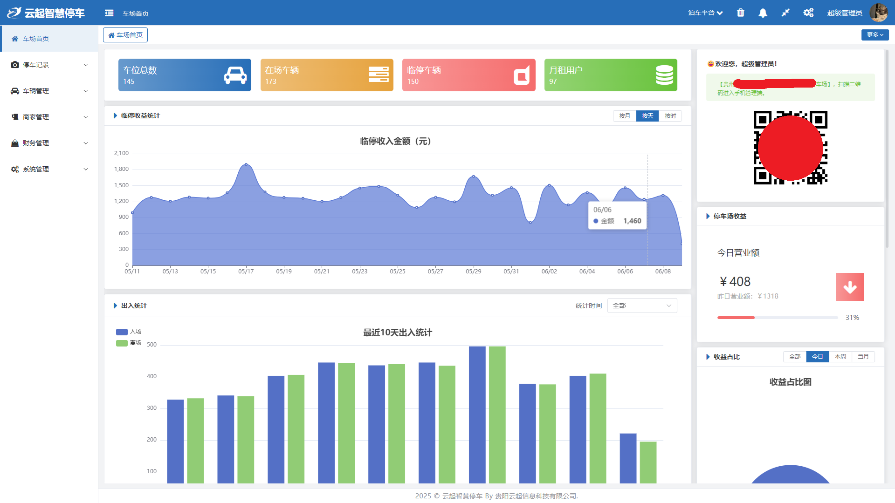
</div>

#### 3、岗亭PC端
<div style="text-align: center">
    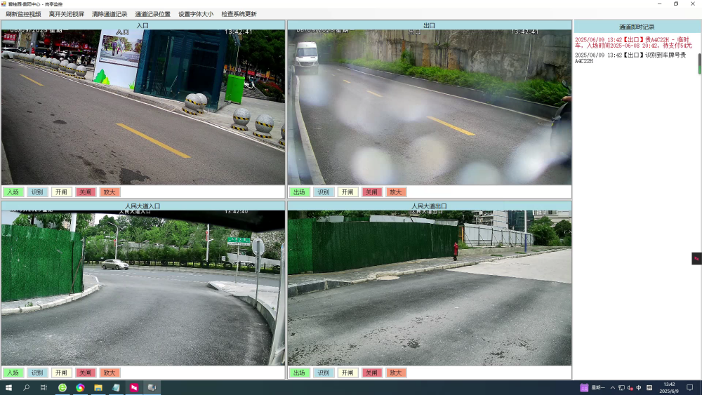
</div>

#### 4、岗亭WEB端 
<div style="text-align: center">
    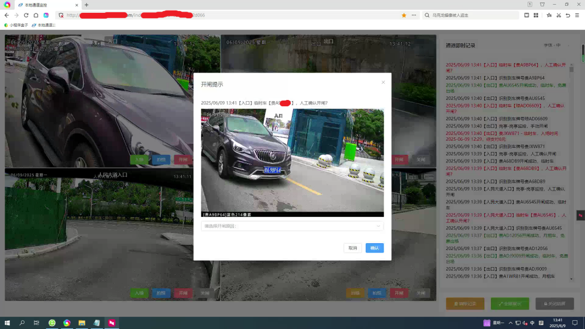
</div>

#### 5、停车场管理手机端
<div style="text-align: center">
    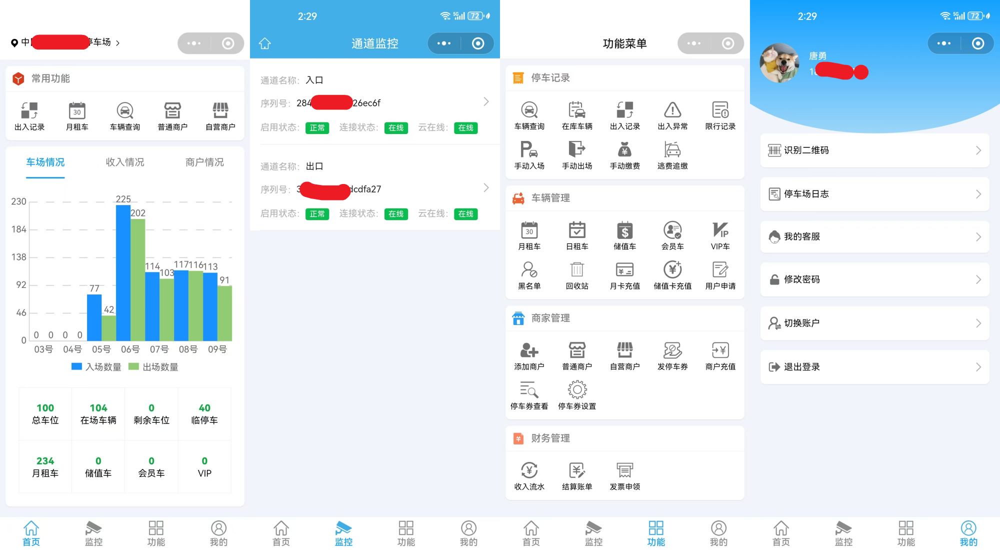
</div>

#### 6、商户管理手机端
<div style="text-align: center">
    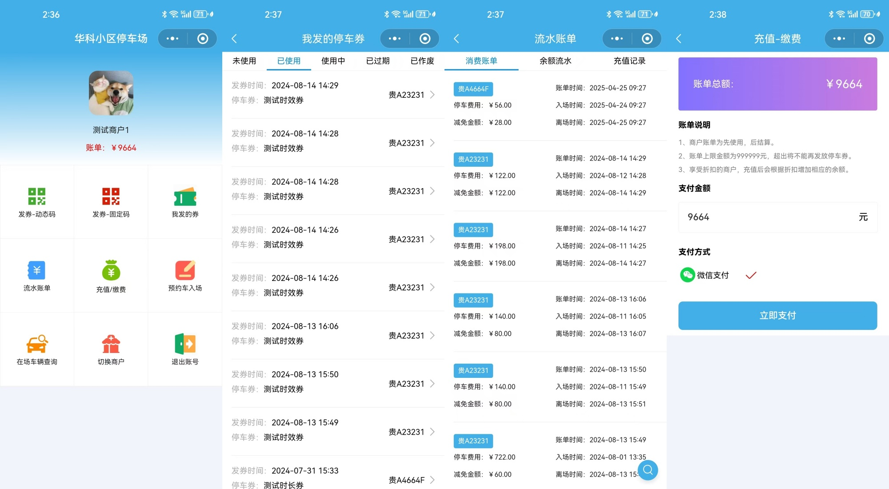
</div>

#### 7、移动收费端（车主端）
<div style="text-align: center">
    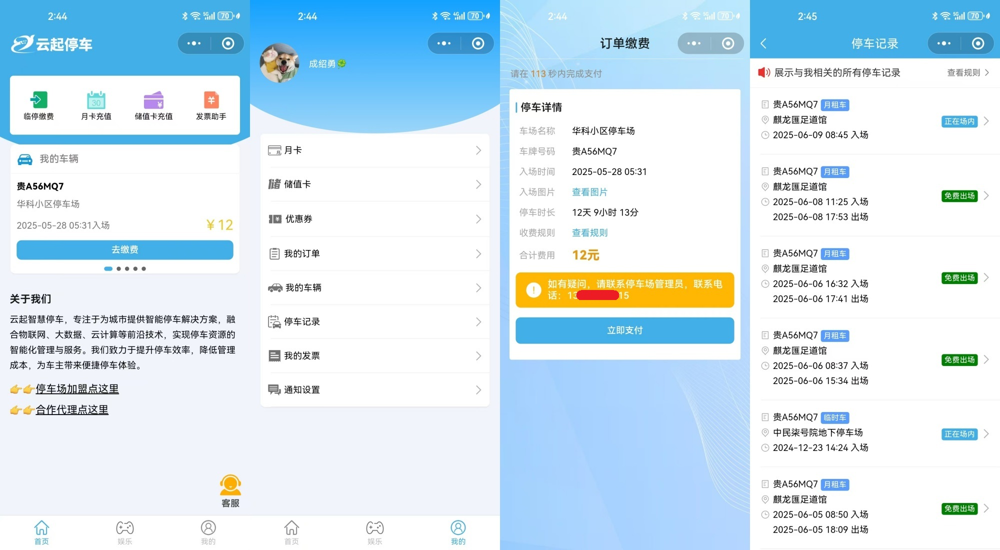
</div>

## 三、商业版权使用说明
<ul>
    <li>
        <p style="margin:5px 0;">本软件使用apache 2.0开源协议，请自觉保留代码与UI版权声明，可以直接应用于商业用途。</p>
    </li>
    <li>
        <p style="margin:5px 0;">本软件已经申请了著作权，请勿在主体架构使用本软件的情况下，二次申请软件著作权，如有著作权的授权需求，请联系作者。</p>
    </li>
    <li>
        <p style="margin:5px 0;">本软件免费提供给有需求的商业用户，但禁止利用信息差，冒充作者出售，或二次开发后出售给第三方公司。</p>
    </li>
    <li>
        <p style="margin:5px 0;">以上声明请自觉遵守，如有违背，公司将采取法律手段进行追究。</p>
    </li>
    <li>
        <p>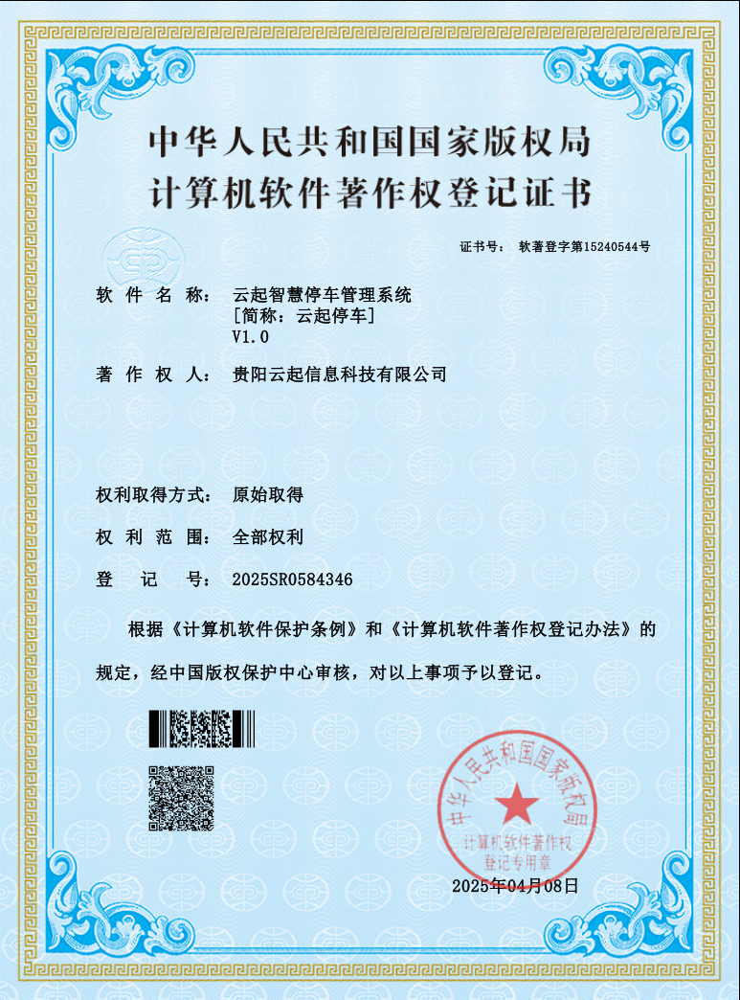</p>
    </li>
</ul>

## 四、准备安装环境
* 一台Linux服务器，4核8G（本地安装mysql建议16G内存），宽带大于5mb
* 安装Nginx 1.26
* 安装PHP 8.2
* 安装Mysql 8.0
* 安装Redis 7.4
* 安装Mosquitto 2.0
* 准备好5个二级域名，并解析到服务器的IP
* 注册认证微信小程序与为微信公众号
* 注册认证微信开放平台，并将小程序与公众号关联
* 注册认证支付宝小程序（可选）
* 申请企业邮箱SMTP服务
* 注册并认证臻识云平台账户
* 开通阿里云OSS服务

## 五、系统安装
### 安装服务端
#### 1、下载服务端源码，https://gitee.com/lcfms/yunqi-smart-parking---server
#### 2、安装数据库和视图，文件所在目录：/storage/sql
#### 3、安装php扩展，fileinfo，redis，Swoole6
#### 4、打开/config/app.php，完成域名配置（下面凡与test.com域名相关皆替换成你的域名）
```
// 域名绑定（自动多应用模式有效）
'domain_bind'      => [
    //系统管理端web端域名
    'admin.test.com'=>'admin',
    //停车场管理web端域名
    'parking.test.com'=>'parking',
    //岗亭web端域名
    'screen.test.com'=>'screen',
    //api服务域名
    'api.test.com'=>'api',
    //官网域名
    'www.test.com'=>'index'
],
```
#### 5、配置Nginx，除了screen.test.com，让访问的域名都支持SSL，设置根目录为public，开启thinkphp伪静态
#### 6、配置Mysql，拷贝.example.env的内容生成.env，修改配置信息
#### 7、访问系统管理端https://admin.test.com/index，默认的用户名：admin，密码：admin123
#### 8、完善系统配置
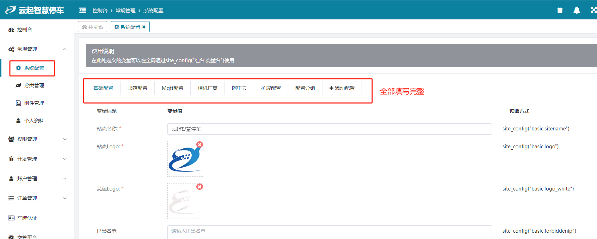

#### 9、在命令行窗口启动队列任务
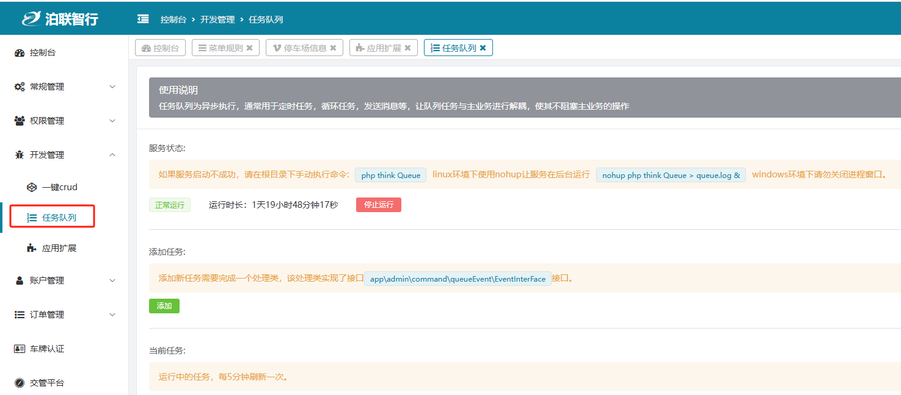

#### 10、在命令行窗口启动相机监听
（1）启动监听相机接收消息：php think Mqtt receive<br>
（2）启动监听相机发送消息：php think Mqtt publish<br>
（3）启动监听相机在线状态：php think Mqtt keepalive<br>

### 公众号配置
#### 1、完成公众号接口配置
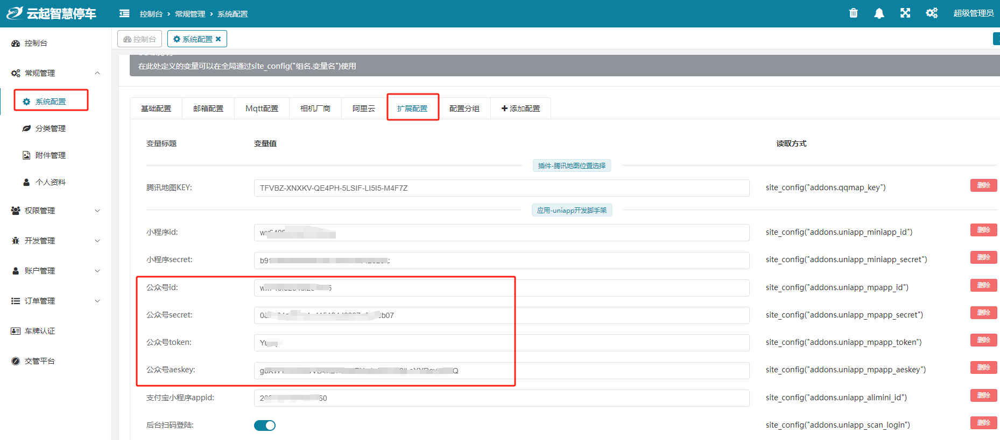
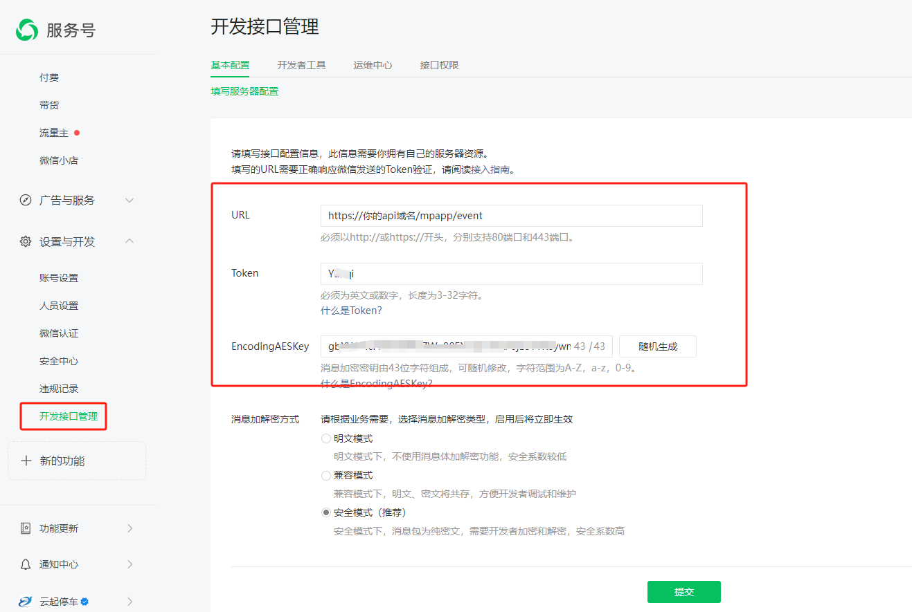

#### 2、生成公众号菜单
访问：https://api.test.com/mpapp/menu
#### 3、申请公众号模板消息，并完成配置
根据/app/common/service/msg/WechatMsg.php文件中定义的模板消息条目，申请模板消息，并完成模板消息的配置
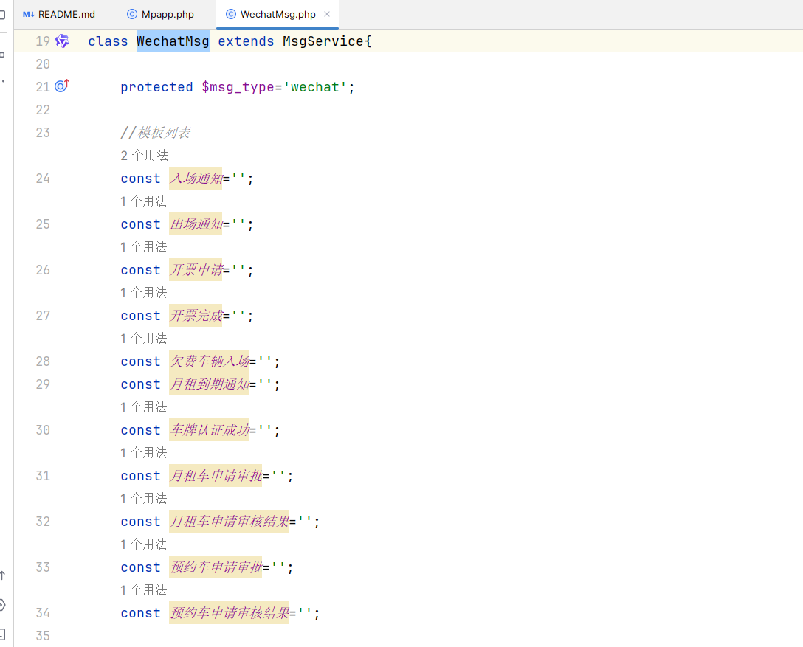

### 用户端打包
#### 1、下载用户端源码，https://gitee.com/lcfms/yunqi-smart-parking---uniapp
#### 2、修改APP.vue文件，配置为：api.test.com
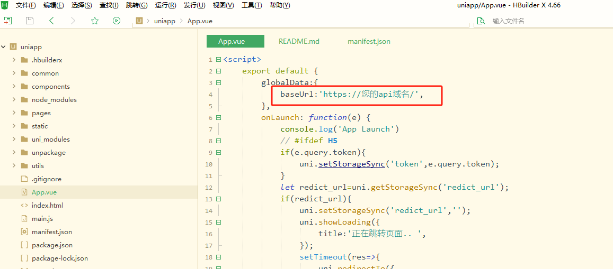

#### 3、用户端使用了firstui的vip版本，由于版权限制，请自行下载安装：https://www.firstui.cn/
#### 4、打包小程序，小程序支持的用户端类型以及入口文件（在公众号菜单已经配置）
（1）平台管理端：/pages/admin/parking<br>
（2）停车场管理端：/pages/parking/index<br>
（3）停车收费端（车主端）：/pages/index/index，也是小程序默认的首页<br>
（4）商户管理端：/pages/merchant/index<br>
#### 5、打包H5，打包域名为：api.test.com，打包完成后放到服务端的/public/h5目录下。
#### 6、H5支持商户PC管理端、停车场管理端的在线监控功能、代理商功能
（1）商户PC管理端：https://api.test.com/h5/#/pages/merchant/index<br>
（2）代理商：https://api.test.com/h5/#/pages/daili/index<br>
### 岗亭打包（岗亭PC端）
#### 1、下载用户端源码，https://gitee.com/lcfms/yunqi-smart-parking---gangting
#### 2、修改/RtspPlayer/Properties/Settings.settings文件的api域名为：api.test.com
